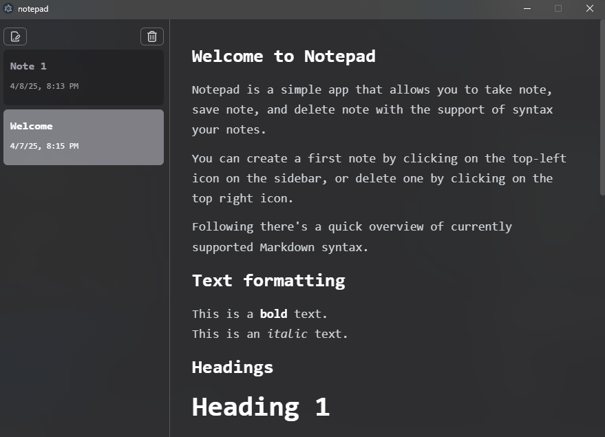

# Notepad App
Notepad is an Electron application with React and TypeScript, a simple app that allows you to take notes, save notes, and delete notes with the support of syntax notes.



## Table of content

- Technologies
- Project structure
- Project setup
- Future implement

## Technologies

- React
- Typescript
- Jotai
- Tailwind

## Project setup

### Install

```bash
$ npm install
```

### Development

```bash
$ npm run dev
```

### Build

```bash
# For windows
$ npm run build:win

# For macOS
$ npm run build:mac

# For Linux
$ npm run build:linux
```

## Future implement

- Add a font style bar on the top of the view.
- Users can choose what style they want when clicking on those style buttons.
- Add a default path to save markdown.
- When the user wants to delete a note, show a confirm dialog.
- Bugs: If there is one note, the user applies changes to the note and clicks a random place in the application, and the duration is not 3s yet, the note doesn't save the changes. It could fix this, if the note is closed before 3s, the note should also be saved.
- Re-design the application.
